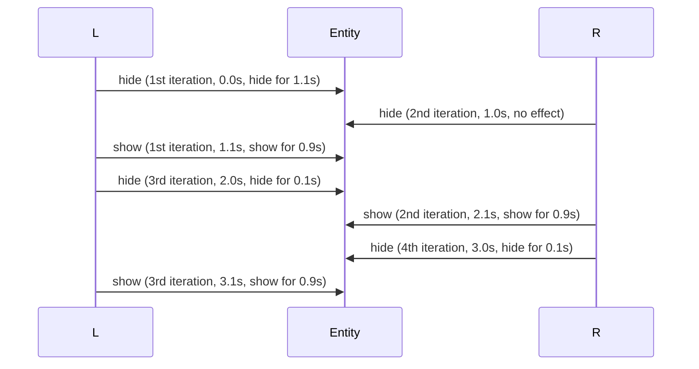

# hstate

A priority-based state management system for FiveM that helps prevent conflicts when multiple scripts manipulate the same entity, ensuring predictable behavior.

## Problem

When multiple scripts call natives like `SetEntityVisible()` on the same entity, they overwrite each other, causing unpredictable behavior. Script A makes an entity invisible, then Script B makes it visible again without knowing Script A's intention.

Typical code before using `hstate` would be:

```lua
function HideEntityTemporarily(entityId)
    CreateThread(function()
        SetEntityVisible(entityId, false, false)
        Citizen.Wait(1100)
        SetEntityVisible(entityId, true, false)
    end)
end
```

What if another script calls this function to hide the entity every second?

```lua
CreateThread(function()
    while true do
        HideEntityTemporarily(PlayerPedId())
        Citizen.Wait(1000)
    end
end)
```

The entity will be invisible only for 0.1 seconds every seconds. This is not what we want.



Sure, you can manage this in your script anyway, but not cross-script.

## Solution

`hstate` provides a handle-based system where each script creates a handle with a priority. The final state is determined by all active handles, ensuring predictable behavior.

```lua
local CreateEntityVisibilityHandle = exports.hstate.CreateEntityVisibilityHandle

function HideEntityTemporarily(entityId)
    CreateThread(function()
        local cancelHiding = CreateEntityVisibilityHandle(entityId, false, 0)
        Citizen.Wait(1000)
        cancelHiding()
    end)
end
```

## Features

- **Priority-based composition**: Handles with higher priority take precedence
- **Automatic cleanup**: Handles can be released when no longer needed
- **Flexible composition strategies**: Boolean, numeric, or custom composition logic

## Installation

Whether you're using Git or some other method, please download the contents of the `release` branch and place them in the appropriate folder under the `resources` directory.

```sh
git clone --depth 1 --branch release https://github.com/af3m/hstate.git "resources/[af3m]/hstate"
```

For LuaLS type settings, please download the contents of the `types` branch and move them to the directory under `workspace.library` in the `.luarc.json` file.

## Why you must use it

Currently, in **FiveM**, there isn't a standardized way to manage conflicts when multiple scripts control the same entity. This gap creates a lot of room for unpredictable behavior and hard-to-debug issues, especially as servers grow and more scripts interact with the same entities.

If you're definitely sure that your script is the only one manipulating an entity, this problem doesn't apply to you. But if you’re working in a shared environment, where multiple scripts might alter the same entity, which is very common, **you must** use a system like **hstate** to prevent conflicts and ensure smooth, predictable behavior.

**Why This Matters:**

- **No Current Standard**: Right now, there is no widely accepted or standardized solution to handle cross-script conflicts in FiveM. Scripts often end up clashing, overwriting each other’s states and leading to unpredictable behavior.

- **hstate Can Fill the Gap**: This library was specifically designed to address this problem in a predictable and reliable way. It allows you to manage entity states across different scripts, ensuring that changes are properly composed based on priority and minimizing conflicts.

- **Be Part of the Solution**: By adopting **hstate**, you’re not just solving your own script's issues, you’re contributing to a broader, more reliable way of managing entity states in the FiveM community. As more people start using it, **hstate** can become the go-to tool for conflict-free entity management, making it easier for everyone to build and maintain stable, conflict-free scripts.

**Think of It as the 'Go-To' System for State Management**

By using **hstate**, you're setting a new standard in state management. It's a simple way to ensure consistency, prevent conflicts, and build better scripts that work together seamlessly
